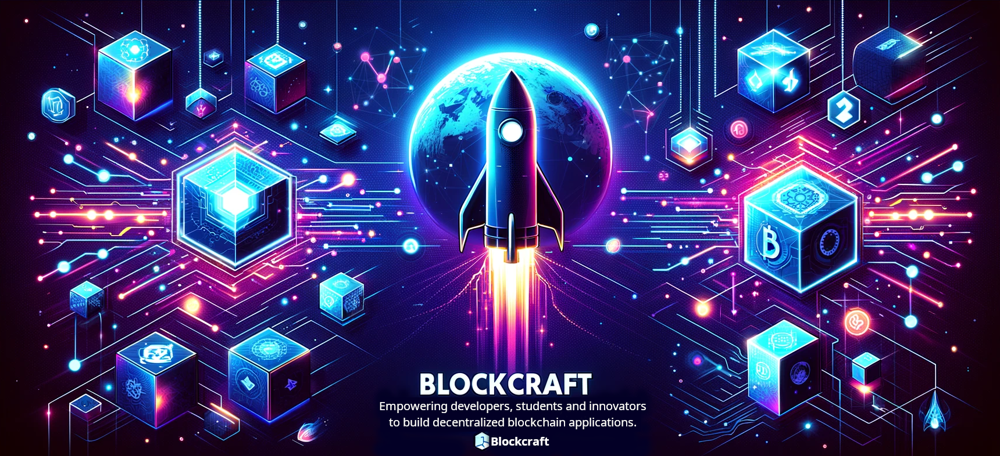

# Blockcraft Demo for Cryptocurrency Use Case 🚀

This project showcases how to create a simple cryptocurrency using [Blockcraft](https://github.com/chrisallenarmbruster/blockcraft), demonstrating the integration of the `Blockchain` and `NetworkNode` classes, along with a proof of work consensus mechanism, mining incentive, data handling, persistent storage, P2P and web service components. It demonstrates the ability to create a blockchain, mine blocks, send transactions, and spin up a single network node or multiple nodes to form a decentralized network.

By following this example, you can learn how to build a fully functional decentralized blockchain application using Blockcraft.

## Interact with an Already Deployed Demo

There is a live deployment of this code that you can interact with. The deployment is running four instances of `src/index.js` (incl. the NetworkNode and Blockchain classes) and one instance of `src/transactionSimulator.js`, forming a decentralized network and a living blockchain.

Access the deployment here: [Explorer Frontend](https://node1.blockcraft.rev4labs.com) and [Blockcraft Vault Wallet](https://vault.blockcraft.rev4labs.com).

## Run the Demo Locally (two options)

There are two ways to run the demo locally.

Requirements:

- Node.js
- npm
- Docker & Docker Compose (for Option 1 only)
- Clone this repo to your local machine
- Install the dependencies by running `npm install` from the root directory of the project.

**Option 1: Running the demo using Docker Compose**:

This is the easiest way to run the demo. It will spin up five containers: four instances of `src/index.js` and one instance of `src/transactionSimulator.js`. This requires Docker and Docker Compose to be installed on your machine.

```bash
# From the root directory of the project:
docker compose up
```

It may take a little time for docker to build the images, this is normal. A few seconds after the nodes come online, the transaction simulator will start. Leave the terminal visible to view the P2P activity.

Access the explorer frontend using a web browser on any of the nodes:

- [http://localhost:50000](http://localhost:50000) (Node 1)
- [http://localhost:50001](http://localhost:50001) (Node 2)
- [http://localhost:50002](http://localhost:50002) (Node 3)
- [http://localhost:50003](http://localhost:50003) (Node 4)

Note: While this demo is designed to run behind a reverse proxy (e.g. Nginx) to handle HTTPS and domain routing, it runs fine locally without a reverse proxy, but the Nodes view in the Explorer will display Docker's internal web service port as opposed to its external port. When behind a reverse proxy, the port mapping is handled normally.

To stop the demo, press `Ctrl+C` in the terminal where you ran `docker compose up`.

**Option 2: Running the demo natively using Node.js in multiple terminals:**

This option involves running each instance of `src/index.js` and `src/transactionSimulator.js` in separate terminal windows. This is a more manual process but a good work around while developing or if you don't have Docker and Docker Compose installed on your machine. A few seconds after you have kicked things off, the transaction simulator will get to work. Leave the terminals visible to the view P2P activity.

```bash
# Terminal 1
node src/index.js src/demoConfig1.json

# Terminal 2
node src/index.js src/demoConfig2.json

# Terminal 3
node src/index.js src/demoConfig3.json

# Terminal 4
node src/index.js src/demoConfig4.json

# Terminal 5
node src/transactionSimulator.js no-docker
```

Access the explorer frontend using a web browser on any of the nodes:

- [http://localhost:3000](http://localhost:3000) (Node 1)
- [http://localhost:3001](http://localhost:3001) (Node 2)
- [http://localhost:3002](http://localhost:3002) (Node 3)
- [http://localhost:3003](http://localhost:3003) (Node 4)

To stop the demo, press `Ctrl+C` in each terminal where you ran `node src/index.js` or `node src/transactionSimulator.js`.
Blockcraft

## Using this Example as a Learning Resource

This project is designed to be a learning resource for those interested in exploring blockchain technology with Blockcraft. It is a simple implementation of a blockchain and network node, and is not intended for production use. It is a starting point for developers who want to learn how to build a blockchain application from scratch. Here is some information about the project structure and how to navigate the code:

- **index.js:** Within the code set, refer to the `src/index.js` file to see how the `Blockchain` and `NetworkNode` classes are used to create a blockchain and network node.

- **trasnsactionSimulator.js:** The `src/transactionSimulator.js` file demonstrates how to work with the API served by each node to retrieve balances and submit transactions to the network.

- **commonConfig.json:** The `src/commonConfig.json` file is a configuration file that is shared by all nodes in the network. It specifies options like the difficulty of the proof of work algorithm, the mining reward, and the port that the nodes will listen on. This is used by both the Docker and Node.js options.

- **demoConfigX.js** The `src/demoConfig1.json`, `src/demoConfig2.json`, `src/demoConfig3.json`, and `src/demoConfig4.json` files are configuration files that you pass to each node instance when running locally using the node.js option. They specify the node's ID, port, and the addresses of the other nodes in the network. These are not used in the Docker option.

- **utils:** The `src/utils` directory contains utility functions that can be used to generate cryptographic keypairs and ICO entries for simulation and testing.

- **docker related files:** There are a handful of files in the root directory that are used by Docker to build and deploy images and run the containers as a stack. These are not used when running the demo natively with Node.js and are not necessary to understand the core concepts of Blockcraft.

## Other Resources

Here are links to related repos:

- [Blockcraft](https://github.com/chrisallenarmbruster/blockcraft): The core library that powers this example, installable as an npm package:

  ```bash
  npm install git+https://github.com/chrisallenarmbruster/blockcraft.git
  ```

- [Blockcraft Explorer](https://github.com/chrisallenarmbruster/blockcraft-explorer): A frontend "Explorer" that provides interaction with the blockchain, transactions and network nodes. This is included with Blockcraft and is also available as a standalone repo for custom implementations.
  <br>

- [Blockcraft Vault](https://github.com/chrisallenarmbruster/blockcraft-vault): A frontend "wallet" employing a zero-knowledge encryption scheme that provides a user interface for managing keypairs, sending transactions, and viewing transaction history.

## Engineers

### [🧑 Chris Armbruster](https://github.com/chrisallenarmbruster)

## License

Copyright (c) 2024 Chris Armbruster

This project is MIT licensed.
